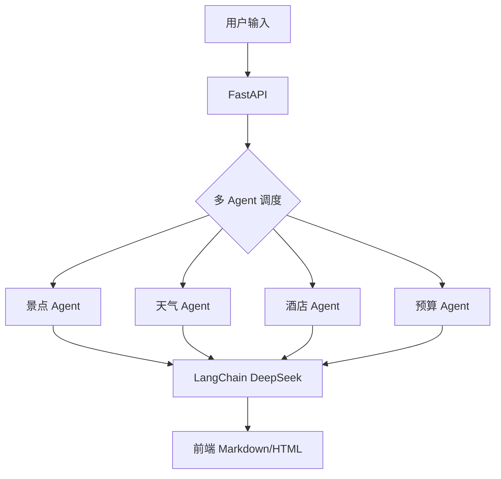

# 🧳 AI 旅行助手（AI Trip Planner）

**这是一个入门级的agent项目，非常适合新手来了解agent和mcp的原理及应用，并且代码非常简洁，对于刚入门的新手很友好**
> 基于 LangChain1.2 + FastAPI + 高德地图 MCP Server 的多智能体行程规划系统  
> 输入目的地 + 日期，30 秒生成「可落地」的详细旅行计划（景点/酒店/天气/预算）


---

## 🌟 功能亮点
| 维度 | 说明 |
|---|---|
| ✅ 多智能体 | 景点搜索 / 天气查询 / 酒店推荐 / 行程规划 四 Agent 并行，互不串台 |
| ✅ 真实数据 | 100% 调用高德地图官方 API，拒绝幻觉 |
| ✅ 高颜值输出 | 每日 2-3 景点 + 三餐 + 酒店 + 门票/餐饮/住宿预算，支持折叠 |
| ✅ 实时天气 | 出发当天自动拉取 7 日预报，穿衣建议同步给出 |
| ✅ 自定义偏好 | 「多博物馆」「避开人流」「亲子友好」等自然语言直接提需求 |

---

## 🏗️ 系统架构


---

##🛠️ 技术栈
- **后端**：FastAPI + Uvicorn + Pydantic v2
- **AI 框架**：LangChain 1.1 + langchain-mcp-adapters
- **LLM**：DeepSeek（通义千问/DeepSeek API 双兼容）
- **地图服务**：高德地图 Web 服务 API（POI + 天气）
- **前端**：Tailwind CDN + 原生 JS（零构建）
- **并发**：SSE 流式输出，每秒实时刷新

---

## 📦 一键本地部署
```bash
# 1. 环境
conda create -n trip python=3.11 -y && conda activate trip

# 2. 依赖
pip install -r requirements.txt

# 3. 密钥（复制后填真实 key）
cp .env.example .env

# 4. 启动
uvicorn trip_planner.main:app --reload --host 0.0.0.0 --port 8000

# 5. 访问
# 前端 http://127.0.0.1:5500（Live Server 或双击 index.html）
# API 文档 http://127.0.0.1:8000/docs
```

---

## 📋 项目结构
```
ai-trip-planner/
├── trip_planner/           # 核心包
│   ├── main.py            # FastAPI 入口
│   ├── trip_planner_agent.py # 多 Agent 编排
│   ├── schemas.py         # Pydantic 模型
│   ├── prompts.py         # 系统提示词
│   └── index.html         # 前端单页
├── my_llm.py              # LLM 初始化
├── env_utils.py           # 环境变量
├── requirements.txt
├── .env.example
└── README.md
```

---

| 文件/目录 | 功能描述 |
| :--- | :--- |
| `trip_planner/` | 存放旅行规划核心逻辑和相关组件的目录。 |
| `trip_planner/trip_planner_agent.py` | 实现了整个应用框架的多智能体核心逻辑。 |
| `trip_planner/schemas.py` | 使用 Pydantic 定义所有输入、输出和内部数据的数据格式。 |
| `trip_planner/prompts.py` | 集中管理和配置系统中各个 Agent 的系统提示词（System Prompts）。 |
| `trip_planner/index.html` | 项目的前端页面文件。 |
| `trip_planner/main.py` | 基于 FastAPI 框架构建的 API 主入口文件。 |
| `my_llm.py` | 用于配置和初始化大型语言模型 (LLM) 访问参数。 |
| `env_utils.py` | 环境变量加载工具，负责读取和处理项目配置。 |
| `requirements.txt` | Python 项目所需的依赖库列表。 |
| `.env` | 环境变量模板文件。**重要：** 使用前需要复制并根据实际环境填写配置。 |
| `README.md` | 项目说明文档（当前文件）。 |

---

## 快速开始

- 创建并激活虚拟环境（推荐）
  conda create -n trip_planner python==3.11
  conda activate trip_planner
  
- 安装依赖
  pip install -r requirements.txt

- 配置环境变量
  在.env文件里配置自己的APIKey:
    - 高德地图 Key 申请地址：https://lbs.amap.com/api/webservice/guide/api/key
    - 通义千问 API：https://help.aliyun.com/zh/dashscope/

- 启动后端
  python main.py 或使用 uvicorn main:app --reload --host 127.0.0.1 --port 8000

- 打开前端
  - 可以下载vscode插件Live Server
  - 或者直接在浏览器打开 index.html 文件，访问http://127.0.0.1:5500

---

## 🔑 密钥申请 2 分钟
| 平台 | 地址 | 免费额度 |
|---|---|---|
| 高德地图 | https://lbs.amap.com/dev/key | 每日 1 万次 |
| 通义千问 | https://dashscope.console.aliyun.com | 100 万 token |

拿到 key 后直接写 `.env`：
```
AMAP_KEY=你的高德key
DEEPSEEK_KEY=你的deepseek-key
```

---

## 🧪 示例请求
```bash
curl -X POST http://localhost:8000/plan \
  -H "Content-Type: application/json" \
  -d '{
        "destination": "成都",
        "days": 3,
        "transport": "高铁",
        "hotel_level": "舒适型",
        "extra": "多安排火锅和熊猫基地"
      }'
```
返回 SSE 流，每秒推送 Markdown 片段，前端实时渲染。

---

## 🙏 致谢
- 高德地图 MCP Server 提供稳定工具集  
- DeepSeek 开源模型降低幻觉率  
- LangChain 官方 1.2 文档 & 社区

---

如果帮到你，给个 Star 支持一下吧 🚀 
